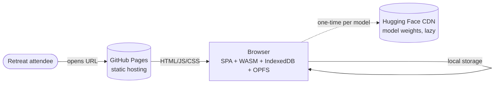
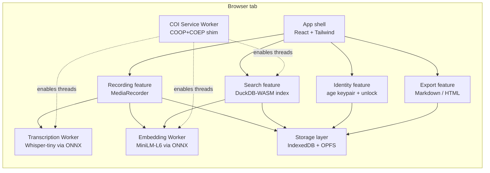
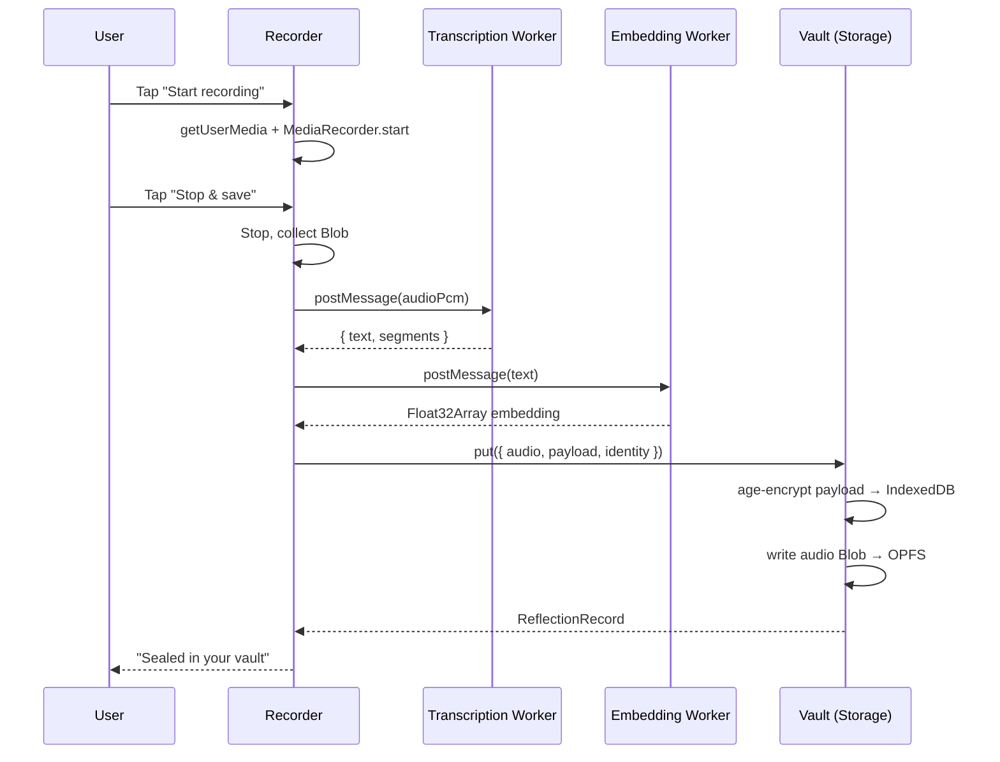
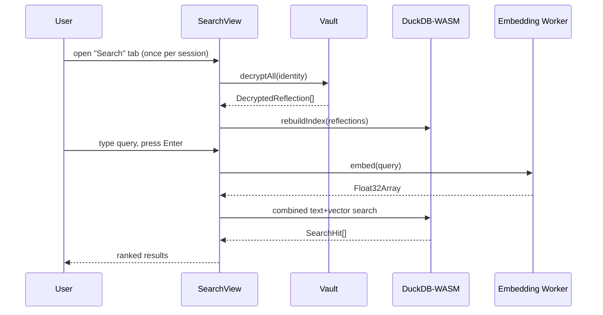

# Architecture

A C4-style sketch of the system. The boundary that matters most: **nothing leaves the browser** without an explicit user action. GitHub Pages is the only network surface — and it only serves static assets.

## C4 — Context

The trust boundary is the device. No backend speaks to the browser at runtime except the asset CDNs above.

## C4 — Container

## Recording → vault flow

## Search flow

## Why each piece exists

- **age-encryption** — auditable spec, simple X25519 + ChaCha20-Poly1305, lets each attendee carry their own key.
- **OPFS** — audio Blobs would bloat IndexedDB; OPFS is the right place for opaque binaries.
- **IndexedDB via idb** — typed transactional store for the structured records.
- **DuckDB-WASM** — combines full-text and vector cosine in one engine. The rebuild cost is paid once per session.
- **Whisper-tiny + MiniLM-L6** — small enough to run in a tab, accurate enough for retreat notes. Tiny Whisper is ~75 MB; "base" or "small" can be substituted later if memory allows.
- **COI service worker** — bridges the gap between GitHub Pages (no header control) and SharedArrayBuffer requirements.

## What is *not* in the architecture

- No server. No proxy. No queue. No background sync.
- No analytics pixels. No CDN beacons. No "anonymous error reporting".
- No third-party auth provider.
- No precomputed data artifacts (the brief's Mode B). All data is user-generated.

These absences are intentional and load-bearing for the privacy story.
